# Project C# Mobile 2023-2024 (ANIFOOD)
Naam en email: **Seppe Baerts 12202625@student.pxl.be**

Titel applicatie: **AniFood**
>[!NOTE]
>Momenteel is alles bijgewerkt. Er moeten alleen nog een aantal kleine aanpassingen komen 
## Wat is Anifood? 
Anifood is een app om het eten van je dieren bij te houden. 
Je kunt hier verschillende gezinnen toevoegen en bij die gezinnen horen natuurlijk ook verschillende huisdieren, verschillende zakken eten.
Anifood is gemaakt om jouw zorgen over te nemen, om ervoor te zorgen dat je nooit met een lege zak voer staat voor de feestdagen. 
Kortom, Anifood is jouw all-in-one partner om het eten (en misschien later ook medicatie) van je dieren bij te houden.

## Doelen:

* ### 20/11/2023
  * Designs voor de Layout.
* ### 01/12/2033
  * API grotendeels (functioneel) klaar hebben
    *  [x] User endpoint (maken en aanmelden)
    *  [x] Family Endpoint (aanmaken van familie en toevoegen van users)
    *  [x] Food endpoint (aanmaken en toevoegen van eten, eten resetten, inhoud bijhouden)
    *  [x] Animal endpoint (aanmaken van animals, toevoegen aan family en toevoegen aan food, eten geven)
* ### 10/12/2023
  * #### Basic App Flow 
    * [x] Bij opstarten kijken of de user is ingelogd en zo naar de juiste pagina sturen (als ingelogd nog altijd checken of die een family heeft. Anders kan de user na het inloggen de app afsluiten en in de verkeerde flow geraken.)
    * [x] Bij het (automatisch) inloggen kijken of de user een family heeft, zo niet → doorsturen naar de add family
    * [x] Bij het aanmaken van een nieuw huisdier & als de user meer dan 1 gezinnen heeft → doorsturen naar een gezinsoverzicht waar de gebruiker kan kiezen bij welk gezin het huisdier hoort
    * [x] Bij het aanmaken van eten word ik doorgestuurd naar een overview met huisdieren/familie, hier kan ik kiezen welke huisdieren ik toevoeg (max. 1 familie per eten).
    * [x] Na de toevoeging van een huisdier/eten/een gezin, wordt een user terug gestuurd naar de home-screen.
  * #### Basic App Functionality
    * [x] Gebruiker moet kunnen inloggen in ingelogd blijven
    * [x] Gebruiker moet huisdieren kunnen opvragen en een hier een overzicht van kunnen krijgen
    * [x] Gebruiker moet van famille kunnen wisselen.
    * [x] Gebruiker moet uit famille kunnen stappen (moet ook nog aan API toegevoegd worden.)
  * ###### _(Sidenote: Tegen deze tijd zou de juiste api moeten overgezet zijn naar de Anifood api)_
* ### 17/12/2023 (This is currently getting skipped because the layout will make it easier)
  * #### Basic App Functionality
    * [x] Gebruiker moet huisdieren eten kunnen geven.
    * [x] Gebruiker kan navigeren met behulp van Tab navigation. (misschien lokaal ergens ook via flyout).
    ###### Deze tab navigation ziet er momenteel niet uit, maar dat is ook niet nodig.
  * #### Advanced App Functionality
    * [x] Wanneer de gebruiker eten geeft, moet dit ook bij de zak veranderen.
    * [x] Gebruiker kan zien hoeveel eten er nog in een zak zit/Hoe lang hij hier nog mee kan doen.
    * [x] Gebruiker kan de details van een huisdier bekijken, (onder andere: laatste moment eten gegeven)
    * [x] Gebruiker kan huisdieren als Favoriete aanduiden en kan ook een lijst met favorieten laten zien.
    * [ ] ~~Gebruiker kan zijn eigen informatie aanpassen (werkt al op api, nog niet mogelijk in app)~~
    * [x] Gebruiker kan de informatie van de dieren aanpassen
    * [ ] ~~Familiehoofd kan de Familie-informatie aanpassen (Wordt niet geimplimenteerd)~~
    * [x] _Eten kan niet aangepast worden!!_
  * #### Settings
    * [x] Gebruiker kan in de settings van app-thema veranderen (styling gaat later pas komen, maar dan veranderd het algemene thema.)
    * [x] Gebruiker kan aangeven of hij/zij wilt dat de families veranderen wanneer hij/zij van locatie veranderd.( Meld aan user: Deze info wordt ON Device + encrypted opgeslagen) => vragen voor locatie services
    * [x] Gebruiker kan aangeven of hij/zij meldingen wilt krijgen wanneer de zak bijna leeg is (kunnen zelf instellen hoeveel dat dat is) => vragen voor meldingen te mogen laten zien.
    * [x] Gebruiker kan aangeven of deze meldingen wilt krijgen wanneer een huisdier op een zelf te bepalen moment nog geen eten/niet al hun eten heeft gekregen.
    * [x] een "info" knop/sub-menu maken, om naar de app informatie pagina te gaan. (is nu **about**)
  * ###### _Nice to have's : gebruiker kan aangeven wanneer er een nieuwe zak is gekocht, hierdoor zal de zak automatisch bijvullen als hij leeg geraakt (moet ook nog toegevoegd worden aan API)_
  * ###### _Sidenote: Tegen deze tijd zou de app gebruiksklaar moeten zijn, gewoon nog niet gebruiksvriendelijk of mooi._
* ### 23/12/2023
  * #### App-Layout
    * [x] De contentPages worden hervormd zoals de figma designs, de styling wordt weggegooid en er wordt custom styling in de plaats geschreven. (DOING)
    * [x] Er wordt gebruik gemaakt van Classes.
    * [x] Er wordt gebruik gemaakt van verschillende resource-directories (bijvoorbeeld: 1 voor de algemene styles, 1 voor de style classes, 1 voor de standaard-kleuren, 1 per thema voor custom kleuren...) om een overzicht te houden (DOING)
    *  ###### (de reden dat ik dit niet vanaf moment 1 doe, is omwille van orde. Het belangrijkste is dat de app functioneel is, en dan pas dat hij er goed uitziet. Als ik de _"volledige"_ app al heb, is er een beter overzicht welke styels ik waar moet doen.)
    * ###### (This is future me: dit was geen goeie keuze. in het begin hielp dit enorm veel maar nu is het overzicht een beetje kwijt, dit neem ik zeker mee naar de toekomst)
  * #### Accessibility
    * [ ] App Accessible maken. (doing)
    * [ ] Een contrast theme.
    * [ ] Gebruik de app met een blinddoek.
    * [ ] Gebruik de app met je stem.
* ### 31/12/2023
  * #### Extra Opties:
    * [X] Wachtwoorden worden ge-hashed.
    * [ ] Probeer met rollen te werken (user mag niet gewoon een dier verwijderen enz..) 
    * [ ] werken met een qr-code om aan de family toegevoegd te worden. 
    * [ ] Een converter maken van string naar ResourceDictionary en dan bij het inladen van de animals die oproepen (zo kun je het thema van de animal aanpassen)
    * [x] gebruik maken van local notifications
    * [ ] _Hier komen nog verdere Extra Opties in_
  * #### Bug Fixes:
    * [ ] _Hier komen dan de known bugs._
    * [x] Wanneer je zeer veel dieren en eten hebt, kan het laden lang duren.
    * [ ] Toast showing white sometimes.(temporary fix: use an api14 android emulator.)
  * #### Kleine Details:
    * [x] Maak een mogelijkheid om te zien hoe lang je nog met het eten kunt doen.
    * [x] Maak een mogelijkheid om terug te gaan vanuit de add-animal menu's
    * [x] Zorg ervoor dat je niet de hele tijd een hele user moet laden bij een kleine aanpassing.
    * [X] Een famillie moet nog aangemaakt kunnen worden, zodat je niet alleen de keuze hebt om die aan te maken bij het aanmaken van een account.
    * [X] De AddAnimal en AddFood pagina een mooier zicht geven
    * [x] Login pagina bijwerken op windows
    * [x] Gebruiker kan eten verwijderen. 
    * [x] registratie pagina verfijnen. 
    * [ ] _Hier komen de "Dat doe ik later wel." stukken_
### Opsomming belangrijkste kenmerken en onderdelen/features van de applicatie:
###### Ze staan eigenlijk al opgesomd Hierboven, maar dit zijn de aller-allerbelangrijkste onderdelen
* Als gebruiker kan ik mij aanmelden en/of registreren
* Als gebruiker móét[^1] ik mij toevoegen aan een familie (via een code) en/of er zelf een maken.
* Als gebruiker kan ik een huisdier toevoegen/aanpassen in de familie
* Als gebruiker kan ik een huisdier eten geven in de app
* Als gebruiker kan ik eten toevoegen/verwijderen/hervullen
* Als gebruiker kan ik zien hoe lang ik nog kan doen met de huidige hoeveelheid brokken.

[^1]: Dit kan later misschien ook "kan" worden, aangezien ik me nu pas bedenk dat een _"John Wick"_ niet echt een familie moet toevoegen en niks heeft aan het hele gedoe.

# Logboek
|             DAG              | WERK VERRICHT                                                                                                                                                                                                                                                           |
|:----------------------------:|-------------------------------------------------------------------------------------------------------------------------------------------------------------------------------------------------------------------------------------------------------------------------|
| 10/11/2023  - 20/11/2023 | Gewerkt aan de page designs in Figma                                                                                                                                                                                                                                    |
|          22/11/2023          | Opzoeken hoe Entity framework werkt                                                                                                                                                                                                                                     |
|          23/11/2023          | Debuggen wat ik fout heb gemaakt met het overnemen van de entity framework code                                                                                                                                                                                         |
|          25/11/2023          | Entity framework opzetten met mogelijke models.                                                                                                                                                                                                                         |
|          26/11/2023          | Database debuggen, de grote lijnen laten werken.                                                                                                                                                                                                                        |
|          27/11/2023          | Begonnen met aanmaken van een Food endpoint                                                                                                                                                                                                                             |
|          29/11/2023          | Food enpoint is gemaakt, login en registratie is in de app gemaakt.(Dit is een skelet en wordt nog geoptimaliseerd.)                                                                                                                                                    |
|          02/12/2023          | README vervolledigen/mooi maken.                                                                                                                                                                                                                                        |
|          04/12/2023          | Updated project to .NET 8, Had a lot of problems.                                                                                                                                                                                                                       |
|          09/12/2023          | LoginFlow (met checks) is gemaakt, add pagina voor een animal is ook gemaakt en je kunt nu ook uitloggen.                                                                                                                                                               |
|          11/12/2023          | Begin van FamilyOverview page gemaakt.                                                                                                                                                                                                                                  |
|          15/12/2023          | RemoveAnimal toegevoegd en leave family is mogelijk gemaakt.                                                                                                                                                                                                            |
|          16/12/2023          | begonnen aan settings, animaloverview, een pagina met connection failed toegevoegd.                                                                                                                                                                                     |
|          23/12/2023          | Begonnen aan de layout aangezien de huidige layout zo verwarrend was dat ik elke keer moest kijken, ook heb ik een value converter toegevoegd.                                                                                                                          |
|          29/12/2023          | Na een kleine pauze, toch de keuze gemaakt om de contentviews links te laten liggen, MainPage en AnimDetailPage aangepast.                                                                                                                                              |
|          30/12/2023          | Zorgen dat je een dier kunt aanpassen, zorgen dat je een foto voor een dier en een foto voor eten kunt toevoegen. Ook de ondergrond gelegd voor een foodOverviewCard                                                                                                    |
|          31/12/2023          | FoodOverview card aangemaakt bij Mainpage, ImageCaching gebruikt, unknown images nu in app.                                                                                                                                                                             |
|          01/01/2024          | Vooral opzoekwerk over contentview en mvvm, Ook gewerkt aan de backend(foto's, laadtijd verbeteren,...)                                                                                                                                                                 |
|          02/01/2024          | Fixed the mainpage, nu is hij veel orderlijker, opzoekwerk gedaan over visual states, sources bijgevult                                                                                                                                                                 |
|          03/01/2024          | (heb koorts vandaag, dus niet zo veel progress) meer info over sementic properties (accessibility), sourcesv2 geüpdate, geprobeerd om de add animal en animal overview page te updaten                                                                                  |
|          04/01/2024          | (nog steeds koorts, maar meer progress) Settings pages beginnen er beter uit te zien, momenteel wel nog niet echt functioneel, Je kunt nu wel al van thema wisselen. Uitloggen is verplaatst naar de Settings                                                           |
|          05/01/2024          | (gaat al iets beter) Popups zelf gemaakt omdat je ze niet kunt oproepen in een ViewModel, dus nu heb ik er zelf gemaakt omdat ik ze dan wel kan oproepen(later besefte ik dat ik het ook kon oproepen, maar toen was het te laat)                                       |
|          06/01/2024          | Gebruik gemaakt van Lottie & Skia, Veel buttons overgezet naar de juiste pagina, AddFamily popups gemaakt, maui toast notifications gedebugd.                                                                                                                           |
|          07/01/2024          | Swipe to feed gemaakt, layout verbeterd, food bag kan nu extra bags toevoegen, users kunnen nu verwijderd worden door familyHead,                                                                                                                                       |
|          08/01/2024          | Geprobeerd om een platform-behavior te maken, is niet gelukt, dus nu een emailvalidationbehavior toegevoegd, en localnotifications aangezet.                                                                                                                            |
|          09/01/2024          | Vrijwel schoonmaken van de add/create-pagina's, functioneel maken van de create family pagina, opzoekwerk over app-icons, je kunt nu ook een familie verwijderen als je de family head bent, algemene styles wat aangepast                                              |
|          12/01/2024          | Readme bijgewerkt, je krijgt nu een melding wanneer je een foodbag wilt verwijderen van eten dat er 0 extra heeft, als je op ok klikt wordt de foodbag verwijderd                                                                                                       |
|          13/01/2024          | Fix visual bugs on windows, Added a black favorite button, now you can click on that to add to favorites in windows. Apperently there is a swipe mode for windows (documentation says it's only on touch devices, but you can swipe with 2 fingers and enable it again. |
|          14/01/2024          | Mensen kunnen nu kiezen tussen dark en light mode, vooral kleine verbeteringen, Thema's gemaakt. Verder aan de documentatie gewerkt.                                                                                                                                    |

# Optioneel: Screenshots
Er is een soort van timeline te vinden in de screenshots folder, maar deze is net iets te lang om te laten zien hier  Dit design is gebaseerd op deze [Figma File](https://www.figma.com/file/qnixY4mmrQMDLO0y1BHCZj/Portfolio?type=design&node-id=11%3A2&mode=design&t=WGQke0ZNuQkHWZoo-1) 

Login Page:

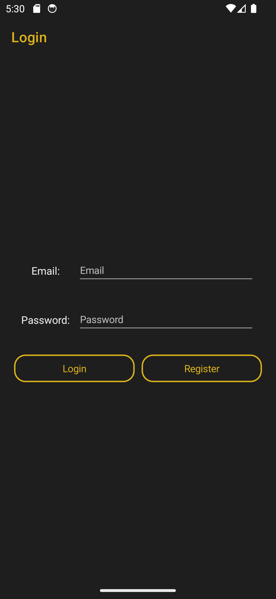

Register Page:

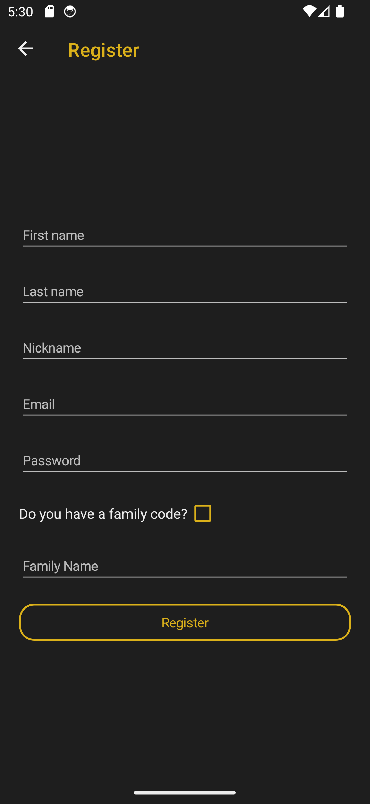

Overview Page:

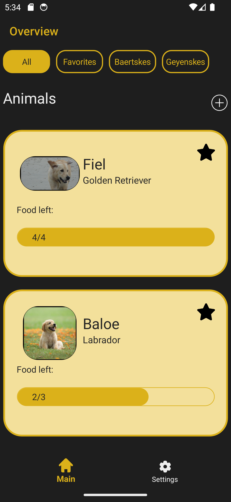
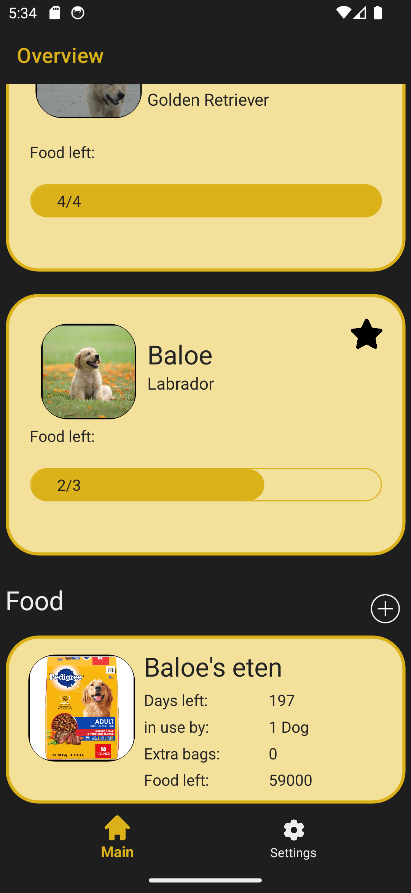

Settings page

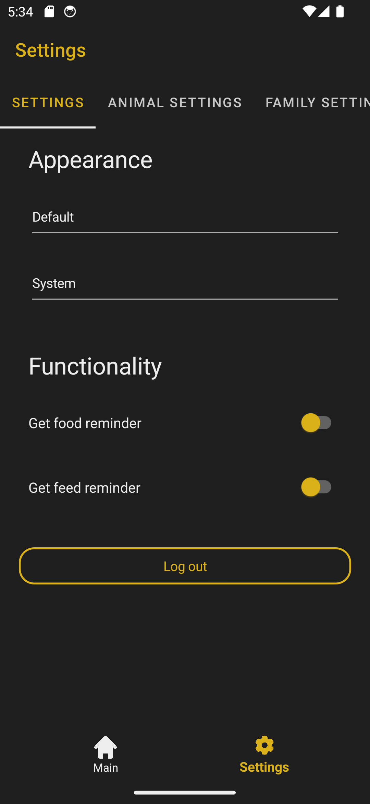
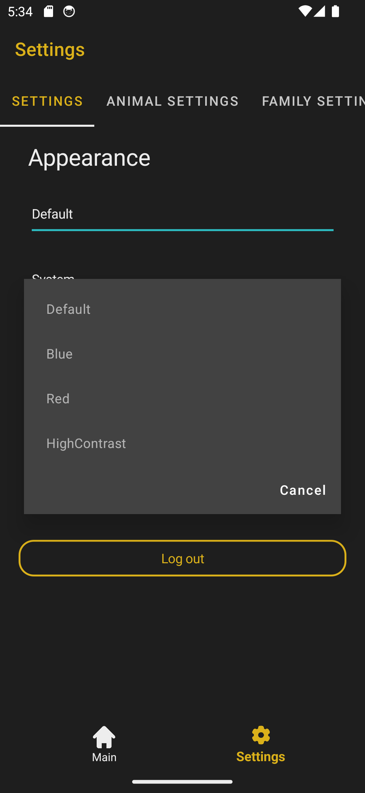
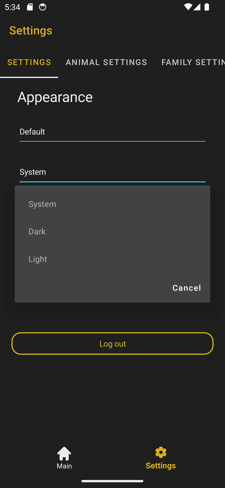

Animal Settings

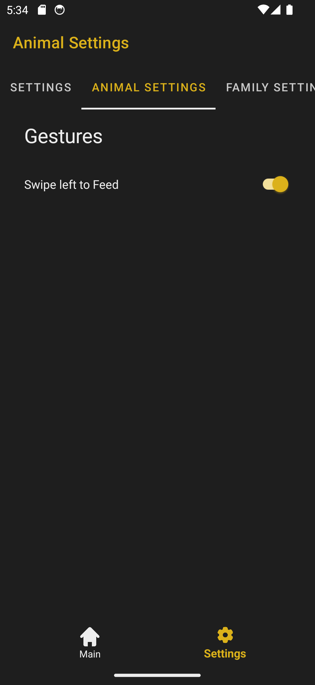

CreatePages

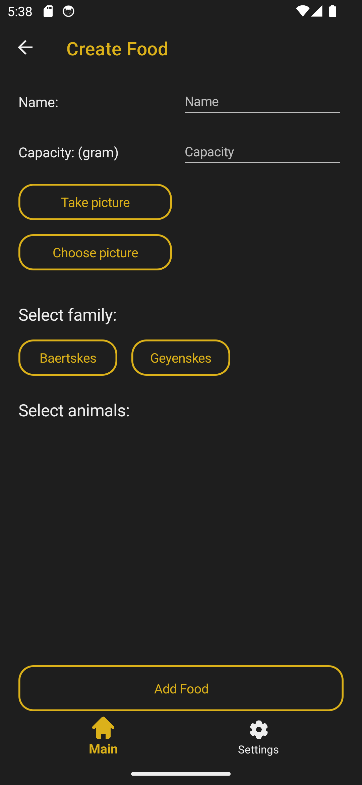
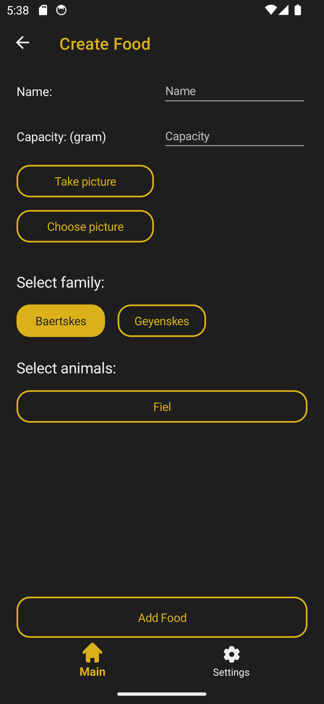
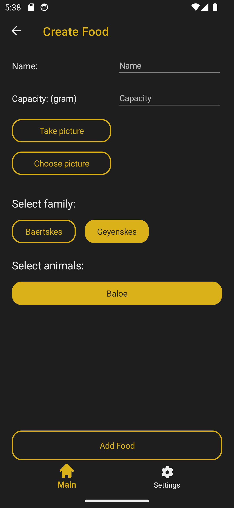
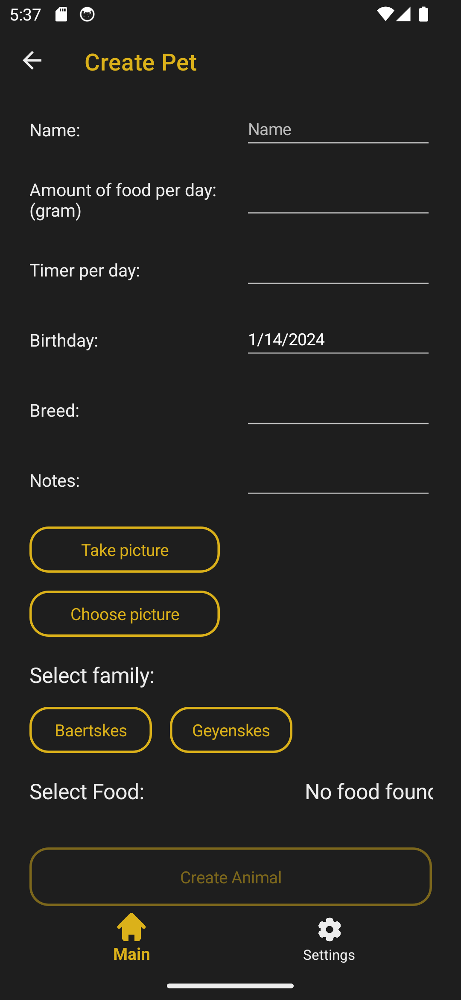
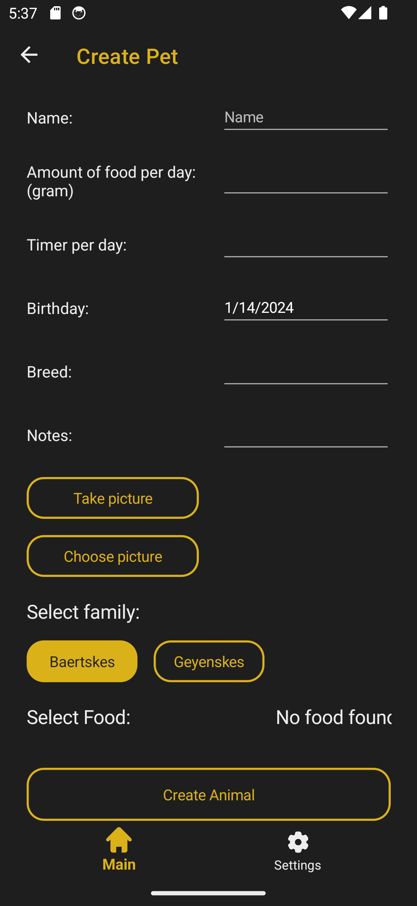
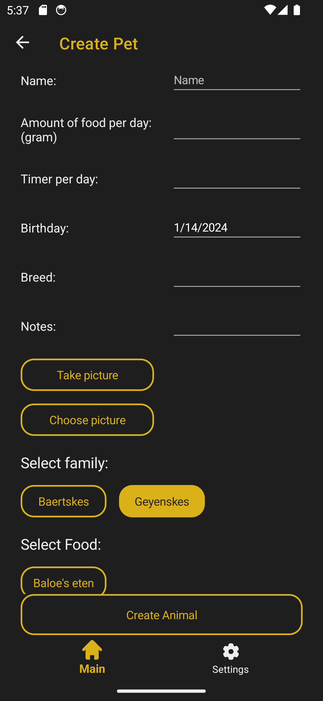
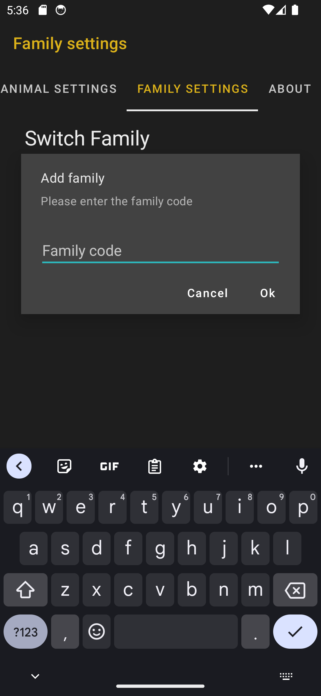

# Videolink
Het zijn een aantal kleine video's, Dit is de [link](https://www.youtube.com/playlist?list=PLZLzuXE27buzv9pCwyaN94jH6FFRsx1Zd) naar de playlist kun je hier terugvinden

# Bronnen
__Om een overzicht te houden tussen de verschillende versies heb ik verschillende files gemaakt.__  
[Bronnen (old).txt](/AniFood/AniFood/SOURCES_text_v1.txt)  
[Bronnen (old).md](/AniFood/AniFood/SOURCES_markdown_v1.md)  
[Bronnen (new).md](/AniFood/AniFood/SOURCES_markdown_v2.md)  
> [!NOTE]
> De 2 files worden aan het einde van dit project ook nog eens samengevoegd. Dit gebeurd alleen op het einde van het project aangezien ik anders te veel aan het copy-pasten ben.

~~[Bronnen (all).md]()~~ (wordt pas op het einde gemaakt)

# Future work
*Wat zou je nog aanpassen/verbeteren mocht je meer tijd hebben? Hoe zou je dit aanpakken?*

* De code verbeteren/refectoren (bijv in de plaats van naar de loading pagina te gaan, gewoon het dier/eten toevoegen aan het gezin)
* Zorgen dat een famillie een foto kan toevoegen en dat een user een foto kan toevoegen. 
* betere manier vinden om eetzakken te tonen, bij te vullen of te verwerken. 
* Performantie verbeteren door bijv aan lazy loading te doen bij veel dieren of ze in een eigen database op te slaan. 
* Natuurlijk mijn voorziene extra's die er nu niet bij zitten toevoegen (_Deze worden op het einde pas toegevoegd_),
* Uitbreiden voor paarden(of alle andere mogelijke dieren)
* uitbreiding voor advertisers (niet met stomme pop-ups, maar gewoon met merken van hondeneten, die kunnen hun eten toevoegen en mss ook via Anifood aankopen,...),
* Mogelijkheid maken om voor grotere text te kiezen.
* *Hier kan nog bijkomen.*

# Notes
Je kunt de web api die ik gebruik als een zip-bestand terugvinden. Ik heb geen idee waarom, maar toen ik het toevoegde aan het project is mijn project kapot gegaan. Dus toen heb ik deze maar verwijderd.